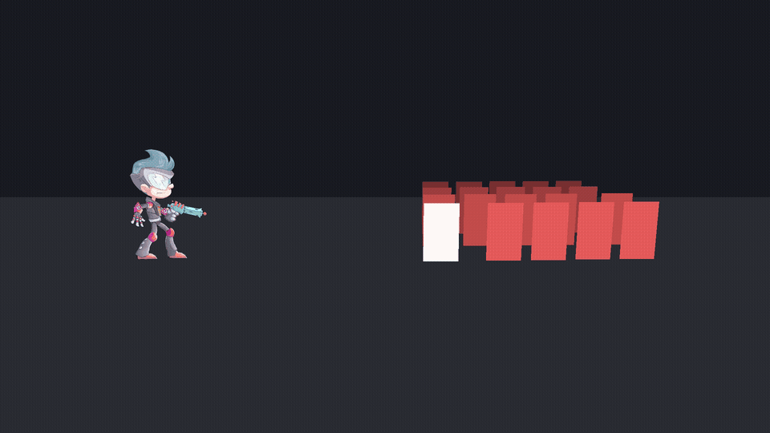

# ShowTime — 전투 연출 파이프라인 데모

> 이것은 게임이 아니라 **전투 연출 파이프라인의 시연**이다.
> 타임라인 한 루프(7.5초) 안에 셰이더 4종, 커스텀 Timeline 트랙 3종+마커, RenderGraph 패스 2종, GPU Instancing 탄막이 전부 재생된다.
> **외부 아트 에셋 0개** — 모든 씬/타임라인/머티리얼/노이즈 텍스처를 에디터 툴이 코드로 생성한다.



*평타 스윕(히트 플래시) → 아웃라인 전멸 예고 → 히트스탑 + 충격파(오브젝트/패스 2방식 동시) + 화면 색조 + 카메라 셰이크 + 탄막 600발 → 디졸브 전멸 → 재등장 루프*

## 무엇을 보여주는 데모인가

| 역량 | 구현 | 코드 |
| --- | --- | --- |
| HLSL/ShaderLab 셰이더 | 플래시·디졸브·아웃라인 통합 셰이더, 그랩 왜곡, 탄환 글로우 (전부 직접 작성, 그래프 아님) | [`Assets/_Project/Shaders`](Assets/_Project/Shaders) |
| Timeline 커스텀 트랙·에디터 툴 | 무상태 클립 트랙 3종 + INotification 마커 2종 + 연출 조립 창 | [`Assets/_Project/Scripts/Timeline`](Assets/_Project/Scripts/Timeline) · [`SkillComposerWindow`](Assets/Editor/SkillComposerWindow.cs) |
| RenderGraph 렌더링 확장 (Unity 6) | 비네트/색조 + 전체 화면 물결 패스 — 평상시 비용 0 설계 | [`Assets/_Project/Scripts/Rendering`](Assets/_Project/Scripts/Rendering) |
| 모바일 최적화 + 실측 | GPU Instancing 탄막 600발 = 드로우콜 +1 (대조군 +434) — CSV 원자료 포함 | [`BulletSystem`](Assets/_Project/Scripts/Bullets/BulletSystem.cs) · [`Docs/perf`](Docs/perf) |
| 아티스트 협업 (기술적 구현) | 코드 없이 클립 배치·튜닝·바인딩이 가능한 조립 툴, 겹침(크로스페이드) 함정 경고 내장 | [`SkillComposerWindow`](Assets/Editor/SkillComposerWindow.cs) |

## 핵심 숫자 (Before/After)

| 탄환 400+ 활성 구간 | GPU Instancing | GameObject 대조군 |
| --- | --- | --- |
| 드로우콜 | **avg 30.7 / max 31** | avg 463.8 / max 534 |
| 셋패스 | 28.7 | 31.9 |
| 프레임 타임 (중앙값) | 5.46ms | 5.73ms |

셋패스가 비슷한 이유(SRP Batcher), 프레임 타임 차이가 작은 이유(고성능 PC의 CPU 여유)까지 포함한 해석은
**[기술 문서 → Docs/TECH_NOTES.md](Docs/TECH_NOTES.md)** 에 있다 — 핵심 구현 4개의 [문제]→[해결]과 시행착오 6건(파일명=클래스명 직렬화 함정, RenderGraph 블릿 검은 화면 삼단 격리 등)을 기록했다.

## 실행 방법

1. Unity **6000.0.77f1** (URP)로 열기
2. 메뉴 `ShowTime → Build M0 Stage` — 씬·타임라인·머티리얼·렌더 피처가 코드로 생성된다
3. `Assets/Scenes/M0_Stage.unity` 플레이 — 루프 재생
4. 연출 편집: `ShowTime → 연출 조립 (Skill Composer)` 또는 Timeline 창에서 `SkillShowcase.playable`

## 프로젝트 구조

```
Assets/
  _Project/
    Shaders/        Mob_Combat(플래시+디졸브+아웃라인), ScreenDistortion, SkillImpact/SkillRipple(블릿), Bullet
    Scripts/
      Timeline/     MobFxTrack + 클립 3종, ShaderFloatTrack, CameraShakeTrack, 마커·수신자, MobGroup
      Rendering/    SkillImpactFeature, SkillRippleFeature (RenderGraph), SkillImpactDriver
      Bullets/      BulletSystem (Instanced/Naive 전환)
      Dev/          FrameRecorder, PerfProbe (검증·실측 도구)
  Editor/           M0StageBuilder, M2TimelineBuilder, M3FeatureInstaller, SkillComposerWindow, NoiseTextureGen
Docs/
  TECH_NOTES.md     기술 문서 (핵심 구현 4 + 시행착오)
  screenshots/      단계별 검증 캡처
  perf/             실측 CSV 원자료
  media/            시연 영상/GIF
```
